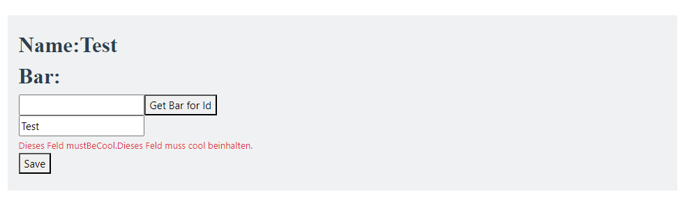
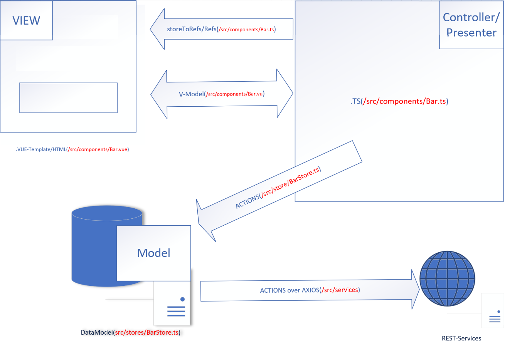

quickstart-mvc-vue3-pinia-axios-vuelidate

Features:
 -MVC-Pattern/bidirektional binding with pinia-store over v-model/toRefs (Bar.ts/Bar.vue/Bar.model.ts/BarStore.ts)
 -validation example to extend(config/validation.ts)
 -i18n
 -backend for REST-Services prepared (BarStore.ts)
 -dev-/prod(".env.production/.env.development") see maven profile "embedded-tomcat"

import in eclipse

clean install

Dev-Mode: execute startConsoleWithNodeNpmSupport.cmd in console and in that console execute: "npm run dev"

Runtime-Mode: clean install -Pembedded-tomcat  -> http://localhost:8082/quickstart-mvc-vue3-pinia-axios-vuelidate

Startpage:

    

MVC in Vue3 mit Pinia:

    

